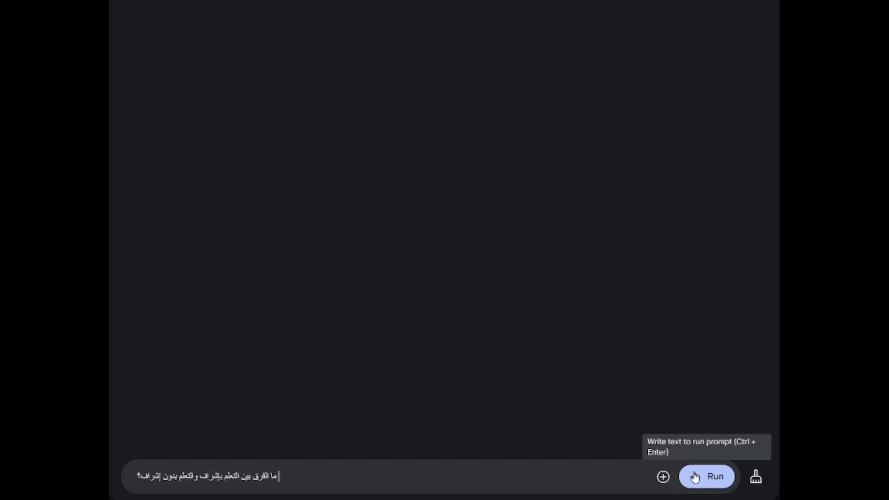
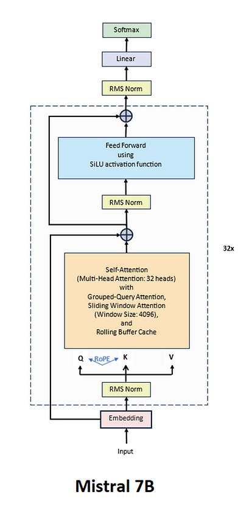
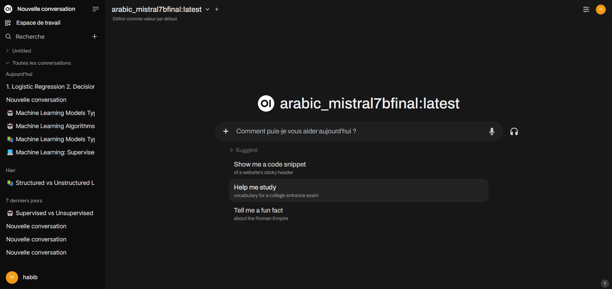

# 🌟 Arabic Chatbot for Machine Learning 🌟

---

## Table of Contents

1. [📌 Project Overview](#-project-overview)
2. [📋 Main Project Steps](#-main-project-steps)
3. [🛠️ Running Mistral 7B and Llama 3.2 Models with Ollama and Docker](#️-running-mistral-7b-and-llama-32-models-with-ollama-and-docker)
4. [📊 Evaluation of LLaMA and Mistral7B Models](#-evaluation-of-llama-and-mistral7b-models)
5. [🚀 Results and Next Steps](#-results-and-next-steps)
6. [📁 Directory Structure](#-directory-structure)

---

## 📌 Project Overview

Development of an Arabic chatbot specialized in machine learning questions, with steps covering data collection, cleaning, translation, fine-tuning of LLM models, and implementation of an intuitive user interface.

---

## 📋 Main Project Steps

### 1️⃣ Data Scraping 🔍
- **Goal:** Collect relevant machine learning Q&A in English.
- **Sources used:**
  - [`Turing Machine Learning Questions`](https://www.turing.com/interview-questions/machine-learning)
  - [`MyGreatLearning Blog`](https://www.mygreatlearning.com/blog/machine-learning-interview-questions/)
- **Tools:** Using `Beautiful Soup` (Python) for scraping.

---

### 2️⃣ Database Cleaning 🧹
- Removal of special characters, unnecessary spaces, and standardization of data format.
- Manual validation to ensure relevance of collected data.

---

### 3️⃣ English → Arabic Translation 🔄
- **Tools used:** Three Hugging Face translation models:
  - [`Helsinki-NLP/opus-mt-en-ar`](https://huggingface.co/Helsinki-NLP/opus-mt-en-ar)
  - [`marefa-nlp/marefa-mt-en-ar`](https://huggingface.co/marefa-nlp/marefa-mt-en-ar)
  - [`t5-v1_1-base`](https://huggingface.co/t5-v1_1-base)
- **Result:** The [`marefa-nlp/marefa-mt-en-ar`](https://huggingface.co/marefa-nlp/marefa-mt-en-ar) model produced the best translations in terms of quality and relevance.


---

### 4️⃣ Cleaning and Formatting Arabic Texts ✨
- **Tools:** Gemini API (via advanced prompts) for:
  - Reformulating and correcting texts.
  - Generating data in SQuAD format (structured Q/A), suitable for model training.
- **Approach:** Multi-shot to ensure varied and coherent examples.


---

### 5️⃣ Fine-tuning LLM Models 🔧
- **Models tested:**
  - **Finetuned Google AI Studio** (the best among the three tested models)
  - **AraBERT**
  - **T5-Small**
- **Result:** Although Finetuned Google AI Studio outperformed other models in terms of performance, none of the three models produced satisfactory results for the specific task.



---

### 6️⃣ Using Ollama and Fine-tuning 🚀
- **Platform used:** Ollama
- **Models tested:**
  - `Mistral 7B`
  - `Llama 3.2`
- **Steps:**
  - Downloading and fine-tuning models with adapted files (`modelfiles`).
- **Comparison:** The **Mistral 7B** model demonstrated superior performance in terms of WSSA scores and qualitative feedback.



---

### 7️⃣ User Interface 💻
- Creation of a user interface with **Ollama Open UI** to interact with the chatbot.
- Investigation of models directly through the interface to validate their responses and perform comparisons.



---

## 🛠️ Running Mistral 7B and Llama 3.2 Models with Ollama and Docker

### 1. Installing Ollama 📥
Before starting, install Ollama on your machine by following these steps:

- Go to the official Ollama website: [https://ollama.ai](https://ollama.ai).
- Download the Ollama version corresponding to your operating system (Windows, macOS, or Linux).
- Install the tool following the platform-specific instructions.

---

### 2. Download the Models ⬇️
Once Ollama is installed, use the following commands to download the necessary models:

#### Download the **Mistral 7B** model:
```bash
ollama pull mistral7b 
```

#### Download the Llama 3.2 model:
```bash
ollama pull llama3.2
```
---

### 3. Create and Run the Models ⚙️
To fine-tune or customize the models with your own data, use the following command:
```bash
ollama create -f <path-to-modelfile> <model-name>
```

- Replace <path-to-modelfile> with the path to your data file.
- Replace <model-name> with the name you want to give to the model.

#### Example:
```bash
ollama create -f ./data/mistral_Modelfile mistral7b-custom
```
---

### 4. Launch Models with Docker and Open Web UI 🐳
If you want to interact with the models via a user-friendly graphical interface, use Open Web UI with Docker.

#### Step 1: Launch Docker Container
```bash
docker run -d -p 3000:8080 --add-host=host.docker.internal:host-gateway \
-v open-webui:/app/backend/data --name open-webui --restart always \
ghcr.io/open-webui/open-webui:main
```

#### Step 2: Check Container
```bash
docker ps
```
#### Step 3: Access Interface
Open your web browser and go to:

http://localhost:3000


---

## 📊 Evaluation of LLaMA and Mistral7B Models

This project evaluates the performance of **LLaMA** and **Mistral7B** models using different metrics to compare their generated responses in a given context, particularly for Arabic language texts. We started with classic metrics such as **BLEU** and **ROUGE-L**, but adopted a new **WSAA** metric (Weighted Semantic Similarity with Arabic-specific Adjustments) for more accurate evaluation.

### 1. **BLEU** and **ROUGE-L** Results 📈

#### Results Table

| **Question** | **Model**    | **BLEU** | **ROUGE-L** |
|--------------|--------------|----------|-------------|
| **1**        | LLaMA        | 0.0413   | 0.3000      |
|              | Mistral7B    | 0.0820   | 0.6667      |
| **2**        | LLaMA        | 0.1083   | 0.0000      |
|              | Mistral7B    | 0.0835   | 0.3478      |
| **3**        | LLaMA        | 0.0390   | 0.0000      |
|              | Mistral7B    | 0.0159   | 0.0000      |

#### Observations 🔍

The results of **BLEU** and **ROUGE-L** metrics show that neither **LLaMA** nor **Mistral7B** achieved satisfactory performance, particularly in question 3 where scores are very low. These classic metrics don't seem suitable for this specific task in Arabic.

---

### 2. Adopting the **WSAA** Metric 📝

For a more relevant evaluation, we chose to adopt the **WSAA metric** (Weighted Semantic Similarity with Arabic-specific Adjustments). This metric takes into account several important aspects:

- **Semantic Coherence**: Measures semantic similarity between generated response and reference.
- **Domain Coverage**: Measures how well domain-specific terms are covered in generated responses.
- **Additional Components**: BLEU and ROUGE are also considered in this Arabic-adjusted metric.

---

### 3. **WSAA** Results 📊

#### Results Table

| **Question** | **Model**   | **Final Score** | **Semantic Coherence** | **Domain Coverage** |
|--------------|-------------|-----------------|------------------------|-------------------|
| **1**        | LLaMA       | 0.3163          | 0.8001                 | 0.0000            |
|              | Mistral7B   | 0.3662          | 0.8205                 | 0.0000            |
| **2**        | LLaMA       | 0.3225          | 0.8749                 | 0.0000            |
|              | Mistral7B   | 0.3461          | 0.8538                 | 0.0000            |
| **3**        | LLaMA       | 0.3425          | 0.7832                 | 0.2500            |
|              | Mistral7B   | 0.3900          | 0.9289                 | 0.2500            |

---

### 4. Conclusion: The Best Model 🏆

In conclusion, although **LLaMA** showed acceptable initial performance according to some metrics, **Mistral7B** proves to be the best performing model based on our **WSAA** metric. This makes it the optimal choice for generating coherent and relevant responses, particularly in an Arabic context.

We therefore recommend **Mistral7B** as the primary model for text generation tasks in this domain.

---

## 🚀 Results and Next Steps
- **Best model:** `Mistral 7B`
- **Next steps:**
  - Improve chatbot robustness across other Arabic dialects 🌍
  - Implement user feedback system to improve responses 📝
  - Develop a RESTful API to facilitate integration 🔗

---

# 📁 Directory Structure
```plaintext
project/
│
├── Improving Squad Files (Api Gemini)/         # Contains formatted datasets and related notebooks
│   ├── clean_text.ipynb                        # Notebook for text cleaning
│   ├── squad_formatted_dataset1-1.json         # Formatted SQuAD dataset version 1.1
│   └── squad_formatted_dataset_multi_shot.json # Multi-shot SQuAD formatted dataset
│
├── data cleaning/                              # Data cleaning scripts and datasets
│   ├── clean.ipynb                             # Notebook for cleaning data
│   ├── cleaned_ml_questions.csv                # Cleaned dataset of ML questions
│   └── greatlearning_ml_questions.csv          # Raw dataset from Great Learning
│
├── Finetune/                                   # Fine-tuning notebooks
│   ├── API gemini.ipynb                        # Notebook for API Gemini fine-tuning
│   ├── AraBERT_.ipynb                          # Notebook for AraBERT fine-tuning
│   ├── t5smallarabe.ipynb                      # Notebook for fine-tuning T5 small Arabic model
│   └── out of memory(ambanovasystemsSambaLingo-Arabic-Chat)/  # Out-of-memory experiments
│
├── Media/                                      # Media assets for the project
│
├── Models_ollama/                              # Models and metric evaluation files
│   ├── Metriques/                              # Metrics evaluation
│   │   └── metriques.ipynb                     # Notebook for metrics evaluation
│   └── ModelFiles/                             # Model generation files
│       ├── generate_model_file.ipynb           # Notebook to generate model files
│       ├── Modelfile llama3.2/                 # Model files for LLaMA 3.2
│       │   └── Modelfile                       # Main model file
│       └── Modelfile Msirtral7b/               # Model files for Msirtral 7B
│           └── Modelfile                       # Main model file
│
├── Scraping/                                   # Scraping scripts and results
│   ├── greatlearning_ml_questions.csv          # Dataset scraped from Great Learning
│   ├── scrape1.ipynb                           # First scraping notebook
│   ├── scrape2.ipynb                           # Second scraping notebook
│   ├── turing_ml_questions_with_images.csv     # Turing ML questions with images
│   ├── httpswww.turing.cominterview-questionsmachine-learning/  # Turing source data
│   └── images/                                 # Images scraped from Turing
│
├── traduction/                                 # Translation datasets and configurations
│   ├── Helsinki-NLPopus-mt-en-ar/              # Helsinki NLP translation configurations
│   ├── marefa-nlpmarefa-mt-en-ar/              # Marefa translation configurations
│   ├── questions_translated.csv                # Translated questions dataset
│   └── t5-v1_1-base/                           # Base configuration for T5 translation
│
└── README.md                                   # Project documentation
```

## 👥 Contributions

This project was developed in collaboration by:

- **Mohamed Habib Kammoun** 👨‍💻
- **Ahmed Rami Belguith** 👨‍💻
- **Dhia Elhak Toukebri** 👨‍💻

<a href="https://github.com/habibkammoun/GenrativeIA_ML_questions_arabic/graphs/contributors">
    
</a>